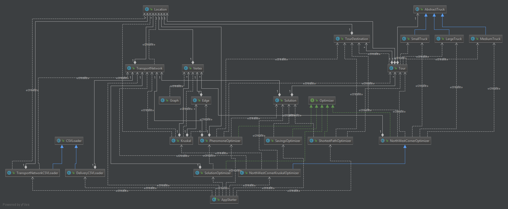
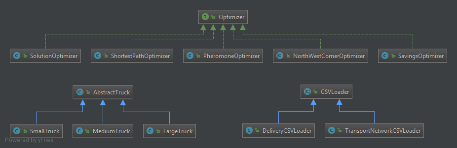

[](https://gitlab.uni-oldenburg.de/transportsysteme-semesteraufgabe/Optimizer/commits/master) [](https://gitlab.uni-oldenburg.de/transportsysteme-semesteraufgabe/Optimizer/commits/master)

# Logistics Optimizer
This logistics optimizer provides multiple algorithms to solve a given transportation problem. In detail those are:

* __ShortestPathOptimizer__ uses the Dijkstra algorithm to find small tours in the graph.
* __NortWestCornerKruskalOptimizer__ uses the NorthWestCorner method and the Kruskal algorithm to fill the table with the ways to the leaf of the minimal spanning tree.
* __SavingsOptimizer__ uses the savings algorithm.
* __PheromoneOptimizer__ which sets a pheromone scent to each location. The intensity of the scent depends on the remaining locations delivery amount needed. Now the trucks only have to drive towards the location with the highest scent and return to the start location.

## Installation guide
```bash
git clone git@gitlab.uni-oldenburg.de:transportsysteme-semesteraufgabe/Optimizer.git
cd Optimizer
mvn clean install
```

## Usage guide
To start the application use the following command pattern from within the project root dir.
```bash
java -jar target/optimizer-1.0.jar [algorithmID] [logisticNetworkPath] [deliveryListPath]
```
where the options can be left blank. Then all algorithms are executed and the default [LogisticNetworkFile](src/main/resources/Logistiknetz.csv) and [DeliveryListFile](src/main/resources/Lieferliste.csv) are used.

The algorithm IDs are:

1. PheromoneOptimizer
2. NorthWestCornerKruskalOptimizer
3. NorthWestCornerOwnOptimizer
4. SavingsOptimizer
5. ShortestPathOptimizer (Dijkstra)
6. SolutionOptimizer
7. Default (all but algorithm 3 and 6) 

Algorithm 3 and 6 are in test mode only.

### Extended Logistics Optimizer

This command starts a more complex transportation problem:

```bash
java -jar target/optimizer-1.0.jar 7 src/main/resources/LogistiknetzMoreComplex.csv src/main/resources/LieferlisteMoreComplex.csv
```

## UML Diagrams



